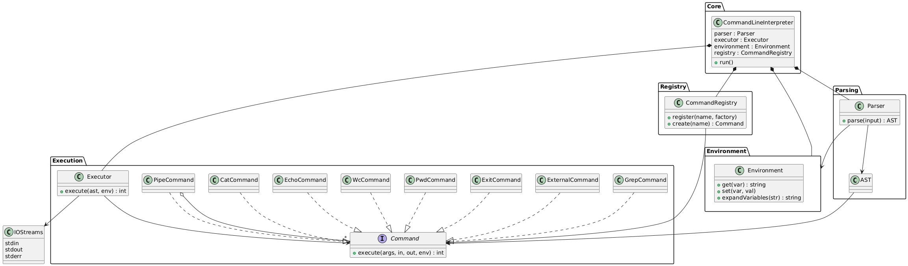

# CLI

## Описание

*CLI* – небольшой интерпретатор командной строки, поддерживающий базовые команды unix-подобных систем, окружение, пайплайны и расширяемость.

**Язык реализации:** C++.

Интерпретатор поддерживает:

- `cat` — вывод содержимого файла.
- `echo` — печать аргументов.
- `wc` — подсчёт строк, слов и байт в файле.
- `pwd` — печать текущей директории.
- `exit` — завершение интерпретатора.
- Переменные окружения (`VAR=значение`, `$VAR`).
- Одинарные и двойные кавычки (полное и слабое экранирование).
- Вызов внешних программ (если команда не реализована явно).
- Пайплайны: `|` для передачи потока вывода между командами.

## Архитектура и компоненты

### Общая структура

### Обзор компонентов

- `CommandLineInterpreter`: главный цикл – ждёт команды пользователя, запускает разбор строки, подстановку, выполнение.
- `Parser`: преобразует пользовательскую строку в AST-представление пайплайна/команд; правильно обрабатывает кавычки, пайпы, выявляет задания переменных, разделяет аргументы.
- `Environment`: хранит и изменяет переменные окружения; занимается подстановкой `$VAR` в аргументах с учётом правил экранирования.
- `Executor`: выполняет объекты-команды из AST, организует передачу потоков в пайплайнах, возвращает коды возврата, управляет завершением цикла через `exit`.
- `CommandRegistry`: реестр – связывает имена команд с классами-фабриками; позволяет легко расширять набор поддерживаемых команд.
- `Command`: интерфейс для всех команд – каждая реализует логику выполнения, принимает аргументы, потоки ввода/вывода, окружение.
- `PipeCommand`: специальный командный объект-композит для выполнения пайплайна.
- `ExternalCommand`: класс для запуска внешних программ через fork/exec (или аналога).
- `AST`: древовидная (или списковая) структура — результат разбора строки.

## Детализация: поток исполнения

1. *Пользовательский ввод* поступает в основной цикл.
2. `Parser` разбирает строку на токены, учитывая:
   - Одинарные/двойные кавычки.
   - Подстановку переменных:  
     - В одинарных кавычках — нет подстановки.  
     - В двойных и вне кавычек — подстановка значений через `Environment`.
   - Запоминание экранированных сегментов.
   - Разделение на команды и пайплайны.
3. *Выделение assignment-команд* (`"VAR=значение ..."`) для изменения окружения.
4. *Построение `AST`*: пайплайн, команды, их аргументы.  
5. `Executor` обрабатывает `AST`:
   - Для пайплайнов создаёт цепочку потоков между командами.
   - Каждая команда получает свои аргументы и потоки ввода/вывода.
   - Все операции `stdin`/`stdout`/`stderr` производятся только через потоки/дескрипторы, не смешивая с аргументами.
   - Коды возврата/ошибки аккуратно отслеживаются.
   - При `exit` — завершает выполнение цикла.
6. Если команда не известна — `ExternalCommand` пытается запустить внешнюю программу с теми же аргументами, окружением и потоками.
7. Побочные эффекты (изменения окружения, вывод) отражаются только внутри текущей сессии.

## Ключевые моменты работы системы

- *Подстановка переменных происходит после токенизации*, с учётом уровня кавычек.
- *Аргументы и входной поток* всегда разделены (например, `echo 123 | wc` — `123` идёт в аргументы, а не во `stdin` команды `wc`).
- *Точка выхода — команда `exit`* (различается вызовом специального флага/исключения).
- *Ошибки в командах отражаются в коде возврата* (например, 1 — ошибка, 127 — команда не найдена).
- *Добавление новой команды* — создать новый класс-наследник `Command`, зарегистрировать его в `CommandRegistry`.
- *Данные пайплайна передаются по потокам, а не списками*.

## Добавление собственных команд

1. Реализуйте интерфейс `Command`.
2. Зарегистрируйте команду в `CommandRegistry` с нужным именем.
3. Готово — появится поддержка новой команды.

## Структура репозитория

- `.github/` — конфигурация для автоматизации (CI/CD).
- `app/` — точка входа, содержит main.cpp и настройки сборки исполняемого файла.
- `cmake/` — дополнительные CMake-модули для управления настройками сборки.
- `include/cli/` — публичные заголовки библиотечных/ключевых компонентов интерпретатора.
- `src/` — реализация основной логики (файлы исходного кода).
- `tests/` — юнит-тесты и интеграционные тесты.
- `LICENSE` — лицензия проекта.

## Требования к сборке и запуску

*Будет актуализированы на следующих этапах.*

## Контакты авторов

- eyakm1
- kristinadriam
- minmise

## Лицензия

MIT license.
